# Aufgabe 1: Installation eines Betriebssystems
In dieser Aufgabe gilt es ein Unix-Betriebssystem zu installieren, das für den Rest des Praktikums als Basis für die Bearbeitung aller weiteren Aufgaben dienen soll.

## Einleitung
Für diese Aufgabe erstellen wir eine VM auf der Host Machine, laden ein VW template, welches bereits eine Partition enthält, verkleinern diese und installieren Ubuntu Server auf den neugeschaffenen freien Speicher. Danach deaktivieren wir nicht benötigte Dienste und erstellen ein paar Benutzer.

## Verbindung mit dem Host Server
Wir unterscheiden hier zwischen zwei Server, dem Praktikum Server oder der Host Server und die Virtual Machines (VM's). Auf dem Host Server laufen mehrere VM's, die den jeweiligen Praktikum teams gehören.

Um unsere VM's zu erstellen, müssen wir also zuerst auf den Hostserver zugreifen, um dort unsere VM's initial zu installieren. So greifen wir auf den Host Server zu:

`ssh <tum-kennung>@psa.in.tum.de`

Danach müssen wir unser Passwort eingeben
Nun starten wir vncserver, damit wir auf die GUI des Hostservers zugreifen können

`vncserver`

Nachdem wir ein passwort festlegen, bekommen wir folgende Rückmeldung:

*New 'X' desktop is psarbg2:18*

18 in dem Fall wäre dann unsere Display Nummer die wir uns merken, und können nun mit dem RealVNC Viewer auf die GUI des Hostservers zugreifen, indem wir folgende Adresse verwenden:

`psa.in.tum.de:18`

Nun können wir die Virtualbox Applikation starten, in unserem Terminal

`VirtualBox`

Ggf. kann man den vncserver prozess mit 

`vncserver -kill :18`

stoppen

## VM Erstellen mithilfe von dem vorgegebenen Template
Hier gehen wir nun auf den Button "Import" und importieren das VM template für unser Praktikum:

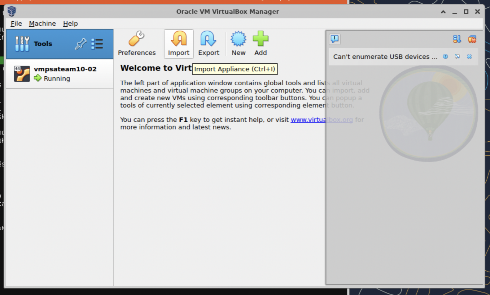

Das template befindet sich unter 

*/opt/psa/data/ISOs VMs/PSA Template.1GB.ova*

Hier wäre es nun wichtig die richtige Mac Adress Policy auszuwählen

Wir können wenn nötig auch die Anzahl an benötigten **CPU's und RAM** erhöhen.

Als Name für unsere VM wählen wir 

`vmpsateam10-01 bzw. vmpsateam10-02`

Nun können wir auf "Finish" klicken und haben unsere VM erstellt.

## Port Forwarding für SSH einrichten
Damit wir uns in zukunft auf die VM einloggen können, müssen wir ein entsprechendes Portforwarding einrichten. 

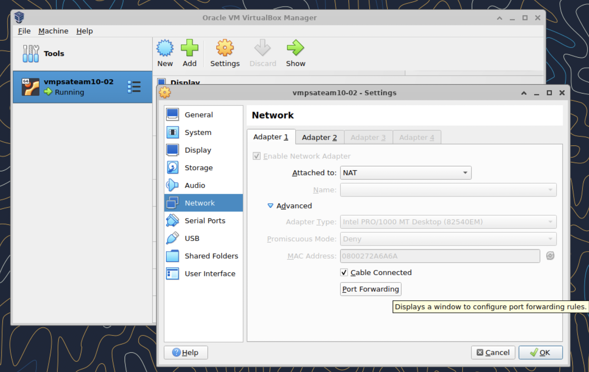

Als Gruppe 10 wurden uns folgende Ports zugewiesen: 61000 - 61099
Als VM Nr. 2 verwende ich den Port **61002**, für VM Nr 1 verwenden wir den Port
`61001`
und forwarden unseren SSH Port 22 dort hin, in der folgenden Einstellung:

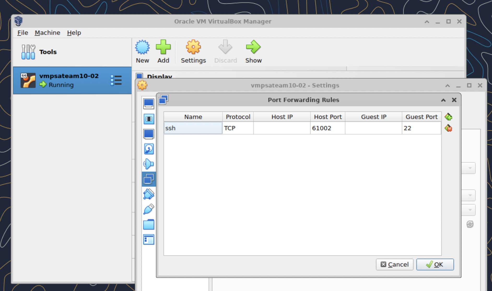

## Partitionieren
Durch das Template wurde uns eine "virtuelle" .vdi Festplatte zugeteilt, die 7 GB groß ist und ganz von einer NTFS Partition besetzt wird, die in wirklichkeit weniger als 50MB Speicher benötigt. Also müssen wir vor der Installation, diese Partition verkleinern oder verschieben.

<!-- Was wir aber zuerst machen werden, ist unsere Festplatte zu verößern, denn nach Ubuntu 22.04 LTS Systemanforderungen, benötigen wir mindestens 25GB freien Speicherplatz. Selbst wenn wir die bestehende partition so verkleinern, dass sie knapp 7 GB Speicher wieder hergibt, liegt sie trotzdem unter den benötigten 25 GB.

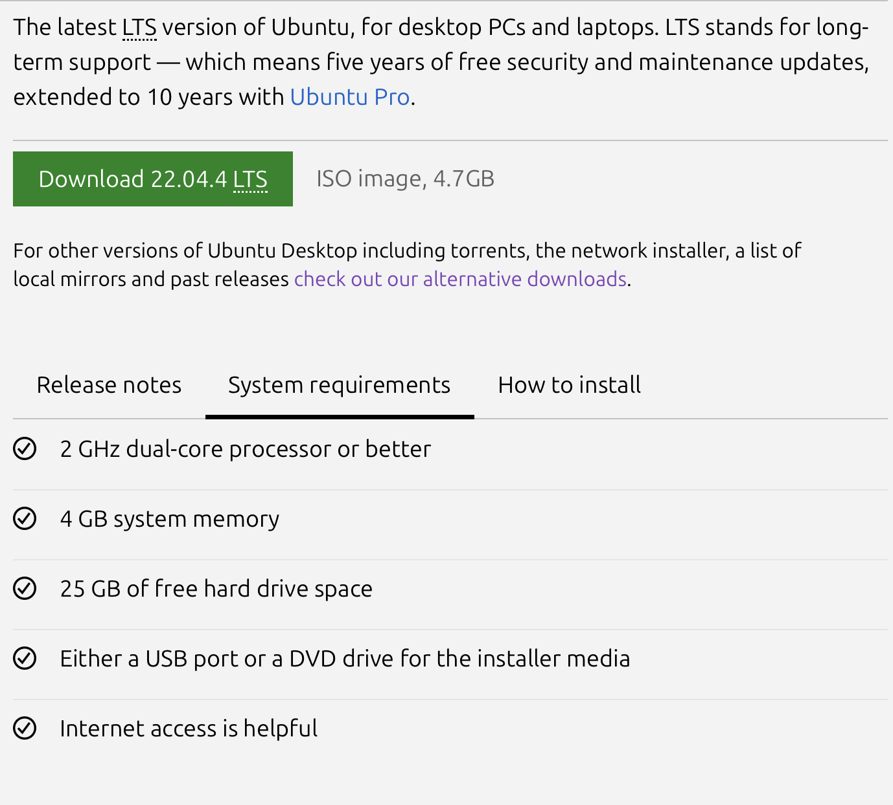

Dazu öffnen wir den Virtual Media Manager von Virtualbox:

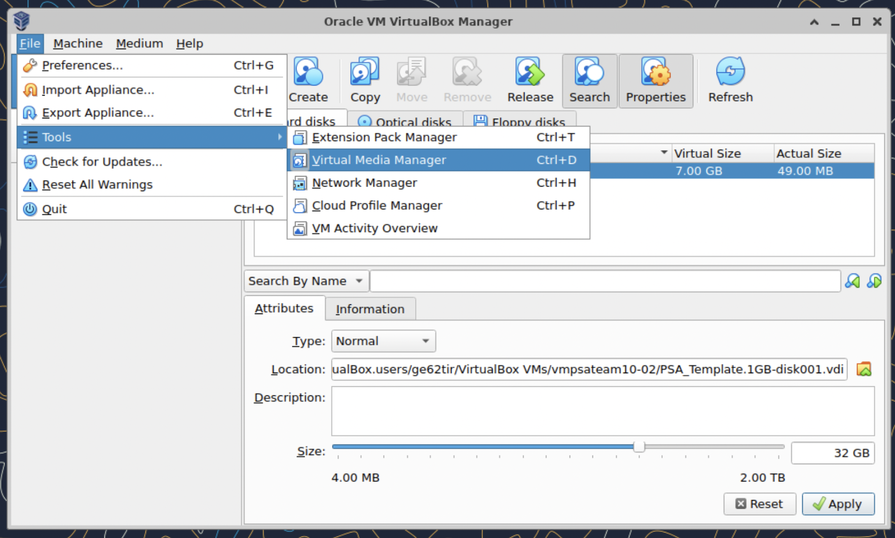

Hier geben wir unter Size 32GB ein und klicken auf Apply:

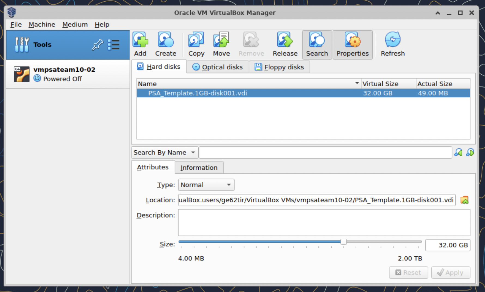

Was ist nun passiert? die alte ntfs partition bleibt und wir haben 25GB freien speicherplatz geschaffen, die wir für neue Partitionen benutzen können. Um die bestehendeWir müssen während dem Installationsprozess noch manuell eine "/" partition und eine "boot" partition erstellen, dazu kommen wir aber später. -->

<!-- Jetzt öffnen wir die Shell um mit *parted* unsere nötigen Partitionen zu erstellen.

Wir gehen also auf oben links auf *enter shell*
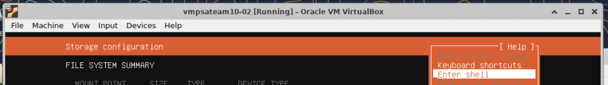
hier geben wir nun folgendes ein:

`parted`

mit `print` sehen wir all unsere aktuellen partitionen.

Wir erstellen nun eine "boot" partition und eine "/" partition mit 

`mkpart primary fat32 7510 8.5G`

`set 2 boot on`

`set 2 esp on`

`mkpart primary ext4 8.5G 33G`

Wir kehren nun zurück zu unserer eigentlichen installation mit:

`quit`

`exit` -->

Da wir auf unserer Festplatte bereits eine NTFS Partition besitzen, müssen wir die verkleinern, um Platz für unser neues Betriebssystem zu schaffen. Auf der Festplatte befintet sich eine Datei aus dem Jahre 2013, welche nicht beschädigt werden soll. Dazu können wir gparted verwenden, welches man hier erhalten kann.

https://gparted.org/download.php

Nun laden wir die Imagedatei und starten unseren Server und starten Gparted

Wir müssen nun folgende Sachen machen:
- ntfs partition auf 50 MB verkleinern
- eine fat32 partition erstellen welche 512MB groß ist und die flags boot, esp hat
- eine ext4 Partition, die den Rest des freien Speicherplatzes besetzt

Nun müssen wir nur noch auf den grünen Pfeil klicken um die Änderungen anzuwenden. Es sollte nun so aussehen:

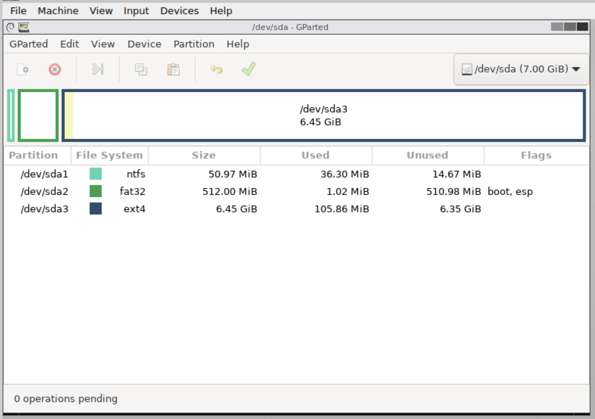

## Betriebssystem Installieren
Da diese VM noch leer ist, müssen wir nun das Betriebssystem installieren. Dafür laden wir die .iso Datei des entsprechenden Betriebssystems runter. Beim Betriebssystem haben wir uns für Ubuntu 22.04 LTS Server entschieden, da dieses Betriebssystem ohne überflüssigen Services kommt, die wir später noch deinstallieren müssen. Auch wird die Server Edition oft für Serveranwendungen, ist lightweight und bietet langanhaltigen Support. Sie kommt deshalb aber leider auch ohne Grafischer User Interface (GUI), sodass wir nur mit der Command Line arbeiten können, was für solche Server aber eigentlich üblich ist.

Um die Installationsimagedatei zu laden, gehen wir hier auf die Storage einstellungen und wählen

`Choose a disk file...`

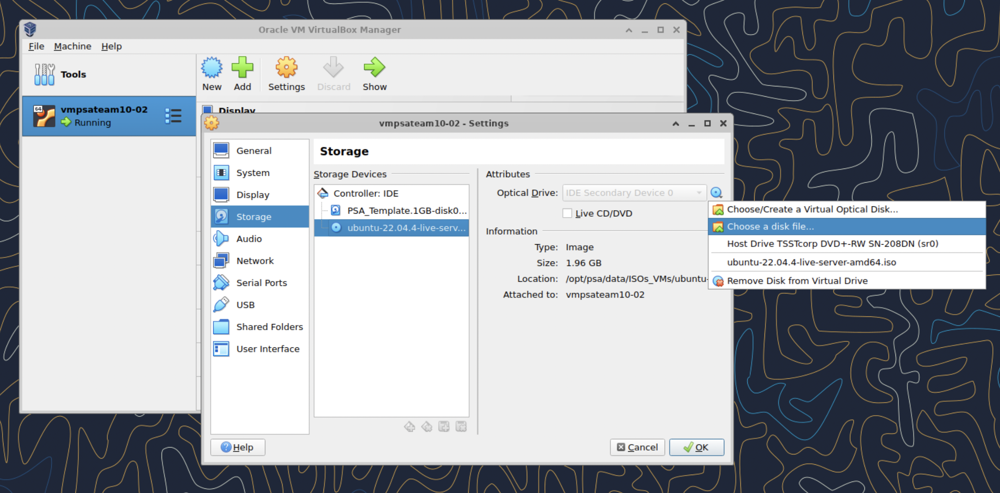

Nun können wir den Server starten, indem wir unter diesen Auswählen, und neben dem Dropdown Menü des Grünen Pfeils, den `Detachable Start` auswählen.

Innerhalb unserer VM wählen wir nun folgende Optionen:
(Eigentlich wählen wir hier überall die Default Optionen)
1. Install Ubuntu Server
2. Keyboard Layout/Variant English (US)
3. Type of Install: Ubuntu Server 
4. Network Connections: Einfach weiter, ohne was zu ändern
5. Proxy Adress: Einfach weiter, ohne was zu ändern
6. Ubuntu Archive Mirror: Einfach weiter, ohne was zu ändern
7. Partitionierung: Custom Storage layout wählen
   1. Partition 3 auswählen -> Edit -> Format: ext4 -> Save

Es sollte so aussehen:

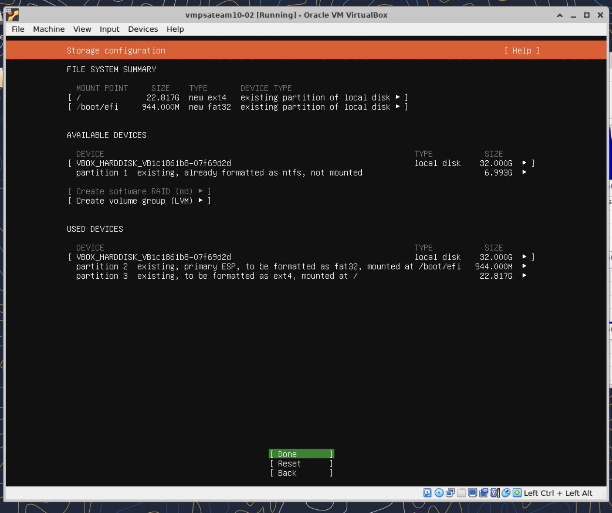

Nun können wir auf Done und Continue klicken. Die bestehende NTFS partition wird dadurch nicht beschädigt, da wir die 2 neu erstellten Partitionen verwenden werden.

Jetzt können wir unseren User einrichten
Name ist der angezeigte Name in der gui und mit dem Username loggt man sich im server ein. Für den username habe ich vorerst "boyo" genommen, da wir die user aller Praktikumsmitglieder später alle noch zusammen einpflegen müssen
Servername entsprechend:
`vmpsateam10-01 bzw. vmpsateam10-02`

- Ubuntu Pro skippen wir 
- installieren OpenSSH server
- Importieren keine SSH Identity
- Keine Snaps installieren

Jetzt können wir unsere VM neustarten und mit dem folgenden Befehl die ssh Verbindung zu unserer VM aufbauen:

`ssh -p <portnummer> <benutzername>@psa.in.tum.de`

wie beispielsweise:

`ssh -p 61002 boyo@psa.in.tum.de`

**Dienste**
Da wir die Ubuntu Server Version verwendet haben, gibt es nicht mehr allzviele Services die mitgeliefert kommen, da nur das nötigste mitgeliefert wird. Viele Services sind zwar nicht unbedingt notwendig, wie z.B. Cron oder rsyslog usw., diese ermöglichen uns aber im Laufe des Praktikums mehr Möglichkeiten zum Debuggen oder Automatisieren, weshalb wir vorsichtshalber, bei Ungewissheit, Services aktiviert lassen.

Wir können nun alle Services uns anzeigen lassen:

`systemctl --type=service --state=running`

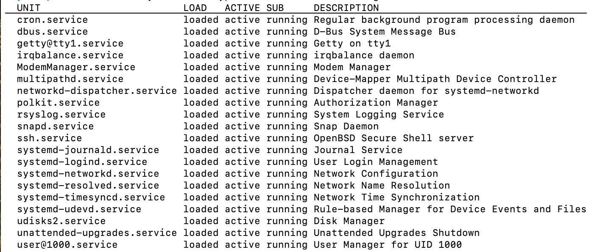

| Service Name | Brauchen wir es? |
|---|---|
| cron.service | Benötigt für regelmäßige Hintergrundprozesse, auch cronjobs genannt, könnten wir später brauchen für Automatisierungen. |
| dbus.service | Ja für die Kommunikation zwischen verschiedenen Prozessen. |
| getty@tty1.service | Ja für die Terminal-Session-Verwaltung. |
| irqbalance.service | Ja zur Optimierung der CPU-Auslastung. |
| ModemManager.service | Nein wir verwenden kein Modem/Mobile Broadband. |
| multipathd.service | Ja wenn mehrere Pfade zu nicht lokalen Speichergeräten vorhanden sind, es kann ja sein, dass wir in Zukunft mit Netzwerkspeichern arbeiten. |
| networkd-dispatcher.service | Ja sicherheitshalber lassen wir den laufen, da er uns ermöglicht, Skripte auszuführen, wenn der Netzwerkstatus sich ändert. |
| polkit.service | Ja ist ein Systemdienst für die Autorisierungsverwaltung. |
| rsyslog.service | Ja für die Logs, damit wir Fehler besser beheben können. |
| snapd.service | Ja, wenn Snap-Pakete verwendet werden, behalten wir, Letsencrypt bevorzugt beispielsweise die Installation durch mit snap. |
| ssh.service | Ja für unser ssh. |
| systemd-journald.service | Ja für die Protokollierung von systemd services, wird uns in Zukunft auch das Debuggen erleichtern. |
| systemd-logind.service | Ja damit sich Benutzer anmelden können. |
| systemd-networkd.service | Ja brauchen wir für die Netzwerkkonfiguration. |
| systemd-resolved.service | Ja brauchen wir für die Netzwerknamensauflösung, z.B. hostname in IP. |
| systemd-timesyncd.service | Ja damit unsere Systemzeit richtig synchronisiert ist. |
| systemd-udevd.service | Ja für die Verwaltung von Geräteereignissen, z.B. wenn ein neues Gerät angeschlossen wird. |
| udisks2.service | Ja für die Festplattenverwaltung, erkennt Festplatten und ermöglicht uns diese zu formatieren/partitionieren. |
| unattended-upgrades.service | Ja für automatische Systemupdates, damit unser Ubuntu sicher und auf dem neusten Stand ist. |
| user@1000.service | Ja für die Benutzerverwaltung, 1000 steht jetzt für meine aktuelle userid. |

## SSH für root
Root login mit einem Passwort ist auf Ubuntu Server generell gesperrt, wir können sollen aber ermöglichen, dass man sich mit einem SSH key einloggen kann, den entsprechenden public key haben wir erhalten.

Nun müssen wir paar Befehle ausführen, wir loggen uns als root ein mit

`sudo su`

danach erstellen/fügen wir unseren public Key zu authorisierten Key's hinzu:

`nano ~/.ssh/authorized_keys`

Wir ändert die Datei so, dass nur der root Benutzer diese lesen und ändern kann

`chmod 600 ~/.ssh/authorized_keys`

Und voila, jetzt kann man sich mit dem entsprechenden private Key einloggen

## Benutzerkennungen einrichten

<!-- It is usually recommended to only use usernames that begin with a lower case letter or an underscore, followed by lower case letters,
       digits, underscores, or dashes. They can end with a dollar sign. In regular expression terms: [a-z_][a-z0-9_-]*[$]? -->
